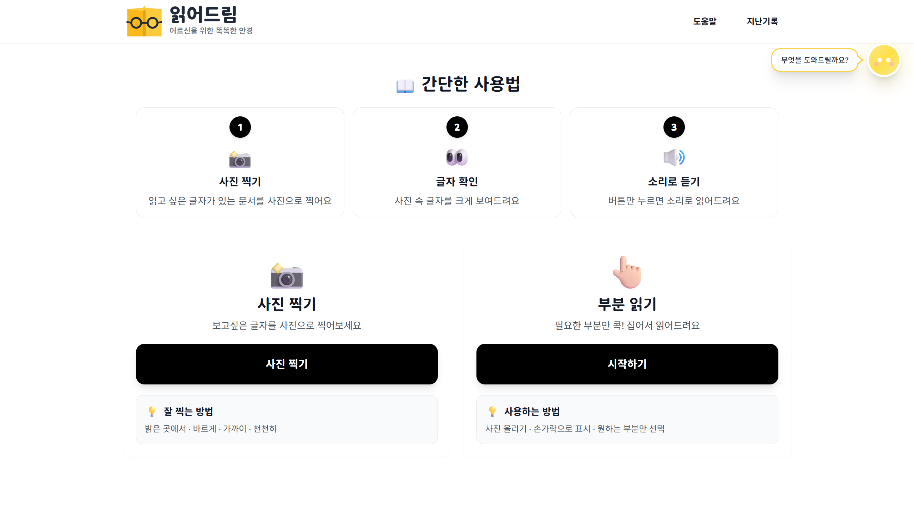
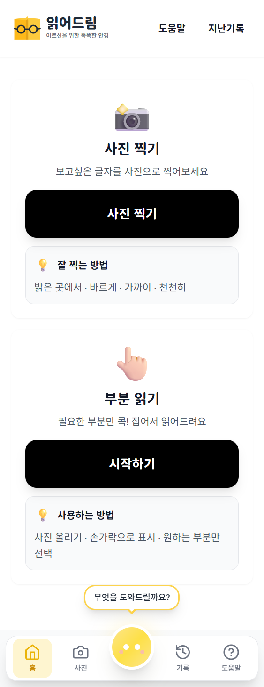

# 읽어드림 - 시니어 친화 OCR PWA

> 어르신들을 위한 문서 읽어주기 앱

<p align="center">
  
  
  
  
  
  
</p>

---

## 프로젝트 소개

### 왜 만들었나요?

어르신들은 작은 글씨의 약 설명서, 공과금 고지서, 각종 안내문을 읽는 데 어려움을 겪습니다.
돋보기를 찾거나 가족에게 부탁하는 대신, **스마트폰으로 사진만 찍으면 큰 소리로 읽어주는 앱**이 있다면 어떨까요?

**읽어드림**은 이런 불편함을 해결하기 위해 만들어졌습니다.

### 이런 분들을 위해 만들었어요

- 작은 글씨가 잘 안 보이는 어르신
- 긴 문서를 읽기 힘드신 분
- 외국어 문서를 번역해서 듣고 싶은 분
- 손이 불편해서 직접 타이핑하기 어려운 분

---

## Preview

<table>
  <tr>
    <td align="center" width="65%">
      <strong>PC 웹 버전</strong><br><br>
      
    </td>
    <td align="center" width="35%">
      <strong>PWA 모바일 버전</strong><br><br>
      
    </td>
  </tr>
</table>

> **모바일 홈 화면에 추가하여 네이티브 앱처럼 사용 가능합니다.**

---

## 주요 기능

| 기능            | 설명                                  |
| --------------- | ------------------------------------- |
| **사진 찍기**   | 문서를 촬영하면 OCR로 텍스트 추출     |
| **부분 읽기**   | 원하는 영역만 선택하여 읽기           |
| **음성 읽기**   | TTS로 추출된 텍스트를 음성으로 읽어줌 |
| **기록 보기**   | 이전 OCR 기록 확인                    |
| **챗봇 리모컨** | 빠른 네비게이션 지원                  |

---

## 시니어 친화 설계

| 특징          | 설명                        |
| ------------- | --------------------------- |
| **큰 버튼**   | 터치하기 쉬운 큼직한 버튼   |
| **큰 글씨**   | 가독성 좋은 폰트와 크기     |
| **심플한 UI** | 복잡하지 않은 직관적인 화면 |
| **음성 안내** | 텍스트를 큰 소리로 읽어줌   |
| **PWA 지원**  | 앱 설치 없이 홈 화면에 추가 |

---

## 아키텍처

```
┌─────────────────────────────────────────────────────────┐
│                      사용자 (브라우저/PWA)                │
└─────────────────────────┬───────────────────────────────┘
                          │
                          ▼
┌─────────────────────────────────────────────────────────┐
│                    Nginx (리버스 프록시)                 │
│                    SSL/HTTPS 처리                       │
└─────────────────────────┬───────────────────────────────┘
                          │
            ┌─────────────┴─────────────┐
            ▼                           ▼
┌───────────────────────┐   ┌───────────────────────┐
│   Frontend (Next.js)  │   │   Backend (FastAPI)   │
│   - React 18          │   │   - EasyOCR           │
│   - TypeScript        │   │   - SQLite            │
│   - Tailwind CSS      │   │   - Python 3.11       │
│   - PWA               │   │                       │
└───────────────────────┘   └───────────────────────┘
```

---

## 기술 스택

| 구분         | 기술                                           |
| ------------ | ---------------------------------------------- |
| **Frontend** | Next.js 14, React 18, TypeScript, Tailwind CSS |
| **Backend**  | FastAPI, Python 3.11, SQLAlchemy, SQLite       |
| **OCR**      | EasyOCR, OpenCV, Pillow                        |
| **TTS**      | Web Speech API                                 |
| **PWA**      | manifest.json, Service Worker                  |
| **배포**     | Docker, Docker Compose, Nginx                  |

---

## 빠른 시작

### Docker로 실행 (권장)

```bash
# 클론
git clone https://github.com/your-username/Senior-OCR-Project.git
cd Senior-OCR-Project

# 실행
docker compose -f docker-compose.local.yml up -d --build

# 접속
# Frontend: http://localhost:3000
# Backend:  http://localhost:8000
```

### 직접 실행 (Docker 없이)

**1. 백엔드**

```bash
cd backend

# 가상환경 생성 및 활성화
python3 -m venv venv
source venv/bin/activate  # Windows: venv\Scripts\activate

# 의존성 설치 및 실행
pip install -r requirements.txt
python main.py
```

**2. 프론트엔드** (새 터미널)

```bash
cd frontend

# 의존성 설치 및 실행
npm install
npm run dev
```

---

## 프로젝트 구조

```
Senior-OCR-Project/
├── frontend/                # Next.js PWA 앱
│   ├── app/                 # App Router 페이지
│   ├── components/          # React 컴포넌트
│   └── public/              # 정적 파일
├── backend/                 # FastAPI 서버
│   ├── routers/             # API 라우터
│   ├── services/            # 비즈니스 로직
│   └── models/              # 데이터 모델
├── nginx/                   # Nginx 설정
├── scripts/                 # 유틸리티 스크립트
├── screenshots/             # 스크린샷
├── docker-compose.yml       # 프로덕션 설정
├── docker-compose.local.yml # 로컬 개발용
└── DEPLOY.md                # 배포 가이드
```

---

## 환경 변수

```bash
# frontend/.env.local
NEXT_PUBLIC_API_URL=http://localhost:8000
```

---

## 배포

자세한 배포 방법은 [DEPLOY.md](./DEPLOY.md)를 참고하세요.

---
