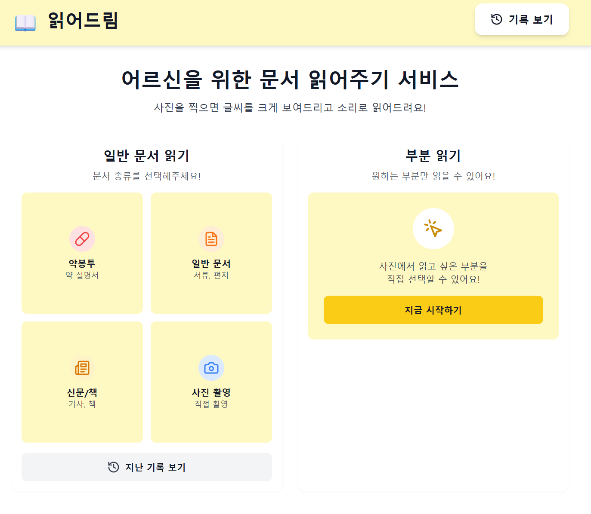
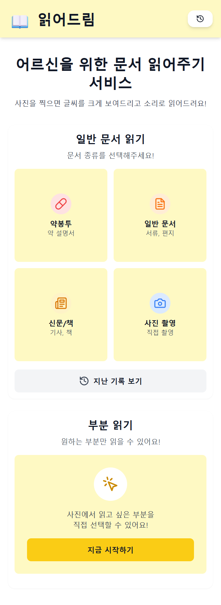

# 읽어드림 - 시니어 친화 OCR PWA

> 어르신들을 위한 문서 읽어주기 앱

**🌐 데모:** [https://goodboy.kakaolab.cloud](https://goodboy.kakaolab.cloud)

---

## Preview

### PC/모바일 웹 화면

### PWA 앱 설치 화면

> 📱 **모바일 홈 화면에 추가하여 네이티브 앱처럼 사용 가능합니다.**

## 프로젝트 소개

**타겟 사용자:** 시니어층 (60세 이상)

**주요 기능:**

- 📷 카메라로 문서 촬영 (HTTPS 환경에서 안전하게)
- 🔍 텍스트 자동 인식 (Tesseract OCR, 한글+영문)
- 🎯 **영역 선택 OCR (NEW!)** - 이미지에서 원하는 부분만 드래그로 선택하여 읽기
- 📖 큰 글씨로 결과 표시 (시니어 친화 UI)
- 🔊 음성으로 읽어주기 (TTS, 속도 조절 가능)
- 💾 히스토리 저장 및 관리 (SQLite DB)
- 📱 PWA 지원 (홈 화면 추가 가능)

**사용 시나리오:**

- 💊 약 봉투 글씨 읽기
- 📄 공공기관 서류 확인
- 📰 신문 기사 크게 보기
- 📦 택배 송장 정보 확인

**접속 방법:**

- 웹: https://goodboy.kakaolab.cloud
- 모바일: 위 주소로 접속 후 "홈 화면에 추가"

---

| 구분              | 기술                                                                                                                                                                           |
| ----------------- | ------------------------------------------------------------------------------------------------------------------------------------------------------------------------------ |
| **Frontend**      | Next.js 14.1, React 18.2, TypeScript, Tailwind CSS, Axios                                                                                                                      |
| **Backend**       | FastAPI 0.109, Python 3.11, SQLAlchemy, SQLite (aiosqlite)                                                                                                                     |
| **OCR**           | Tesseract OCR, pytesseract, OpenCV, Pillow                                                                                                                                     |
| **TTS**           | Web Speech API                                                                                                                                                                 |
| **PWA**           | manifest.json, Service Worker 지원                                                                                                                                             |
| **배포**          | Docker, Docker Compose, Nginx, Docker Hub                                                                                                                                      |
| **도메인**        | goodboy.kakaolab.cloud (HTTPS)                                                                                                                                                 |
| **Docker 이미지** | [leelaeloo/senior-ocr-frontend](https://hub.docker.com/r/leelaeloo/senior-ocr-frontend), [leelaeloo/senior-ocr-backend](https://hub.docker.com/r/leelaeloo/senior-ocr-backend) |

---
